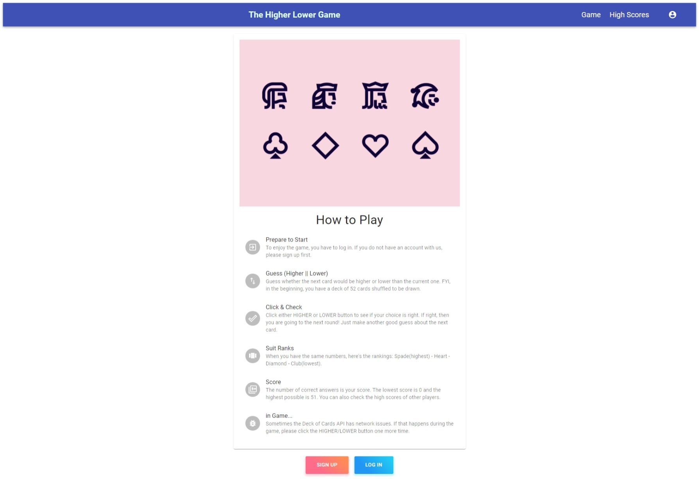
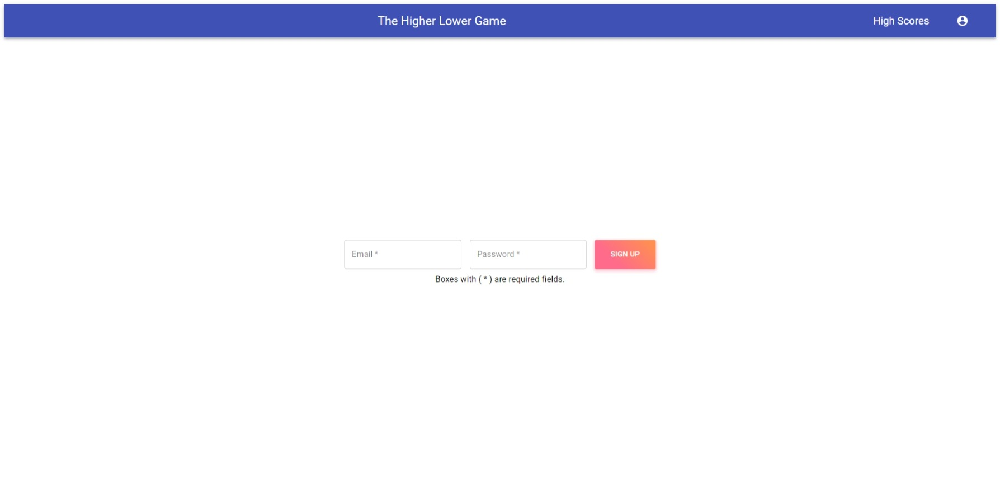
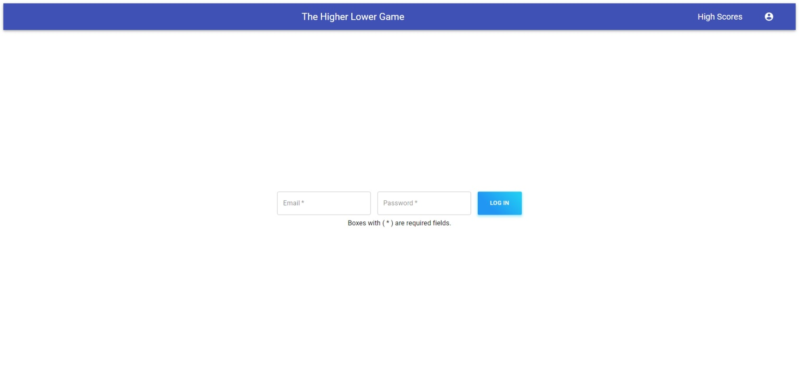
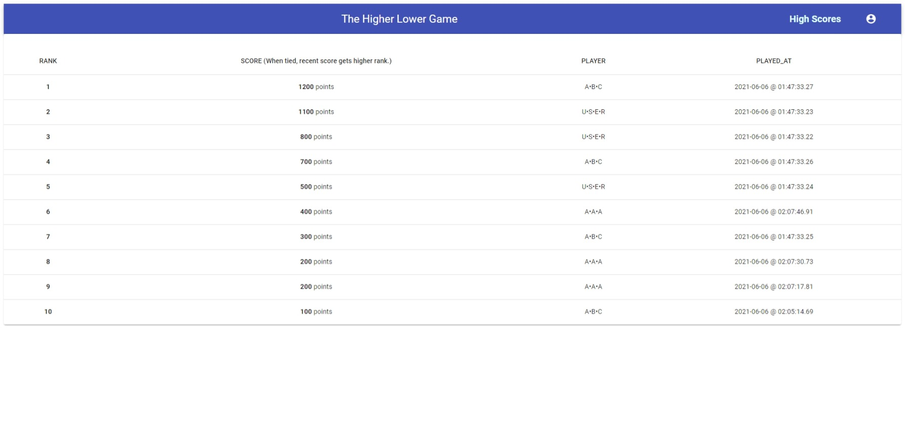
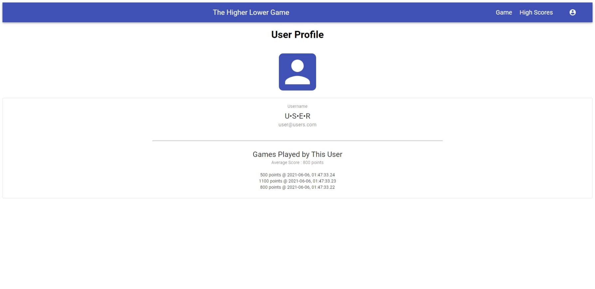
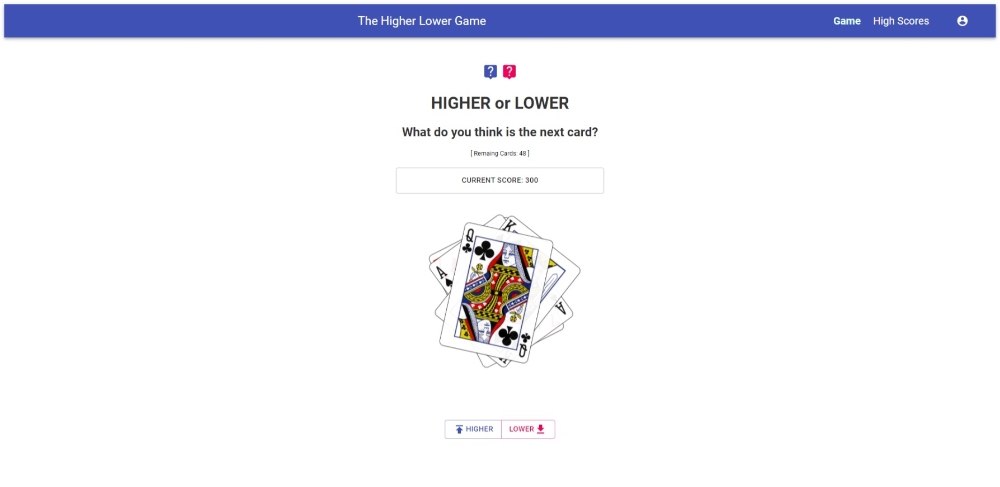

# The Higher Lower Game React-Redux App

by Jinook Jung

* * * * * * * * * *

## How To Set Up the App

0. The backend of this app works best with Ruby 2.6.1 & Rails 6.1.3.1.

1. Visit my [Github repository](https://github.com/jinook929/_flatiron_project5) and clone the code to your local directory:

 `git clone https://github.com/jinook929/_flatiron_project5.git`.

2. Enter into the *_flatiron_project5/flatiron_project5_backend* folder: `cd _flatiron_project5/flatiron_project5_backend`.
3. Execute `bundle install` and run `rails s -p 5000` in terminal. (If you want to reset database, type `rails db:drop db:migrate db:seed`.)
4. In a new terminal, move to the directory, *_flatiron_project5/flatiron_project5_frontend* folder: `cd _flatiron_project5/flatiron_project5_frontend`.
5. Then, execute the `npm install`. When installing is finished, run `npm start` (*Note that you are automatically using port 3000 for frontend, whereas backend used 5000 above*).

## How To Use the App

1. You can either sign up for your own account or use the existing accounts to log in (2 users are pre-set: `user@users.com` & `abc@users.com` [password for both is `123`]).
2. Before logging in, you can see the Rule(=Home) page and High Scores page, but cannot play games.
3. After logging in, you can play game, and visit profile page to check the basic user info and previous game records (+ your average score). To visit the Profile page, just click the account icon on the top right corner of the screen and choose Profile.
4. During the game, the Deck of Cards API could have network issues. Then, please just click the HIGHER/LOWER button one more time.
5. This is a hard game. See if you can pass more than 10 guesses right (which is **1000 points**)!!!

## Screen Captures

### Home Page



### Signup Page



### Login Page



### High Scores Page



### Profile Page



### Game Page



## Data Structure

### Tables

#### users

``` ruby
  t.string :email
  t.string :password_digest
  ...
```

#### games

``` ruby
  t.integer :score
  t.integer :user_id
  t.datetime :created_at
  ...
```

### Model Associations & Validations

#### User

``` ruby
  has_secure_password
  has_many :games, dependent: :destroy
  
  validates_presence_of :email, :password_digest
  validates :email, uniqueness: { case_sensitive: false }
```

#### Game

``` ruby
  belongs_to :user
```

### Redux Store Initial State

``` javascript
{user: null, highScores: []}
```

## Contributing

Bug reports and pull requests are welcome on GitHub at https://github.com/jinook929/_flatiron_project5. This project is intended to be a safe, welcoming space for collaboration, and contributors are expected to adhere to the [Contributor Covenant](contributor-covenant.org) code of conduct.

## Contributors

* Jinook Jung <jinook929@gmail.com>

## License & Copyright

© Jinook Jung

The app is available as open source under the terms of the [MIT License](http://opensource.org/licenses/MIT).
